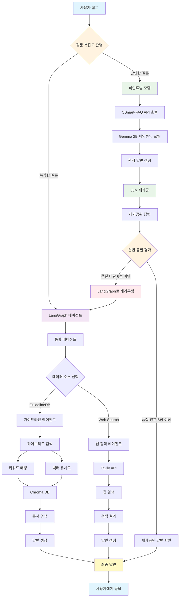
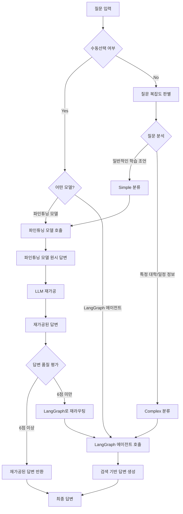
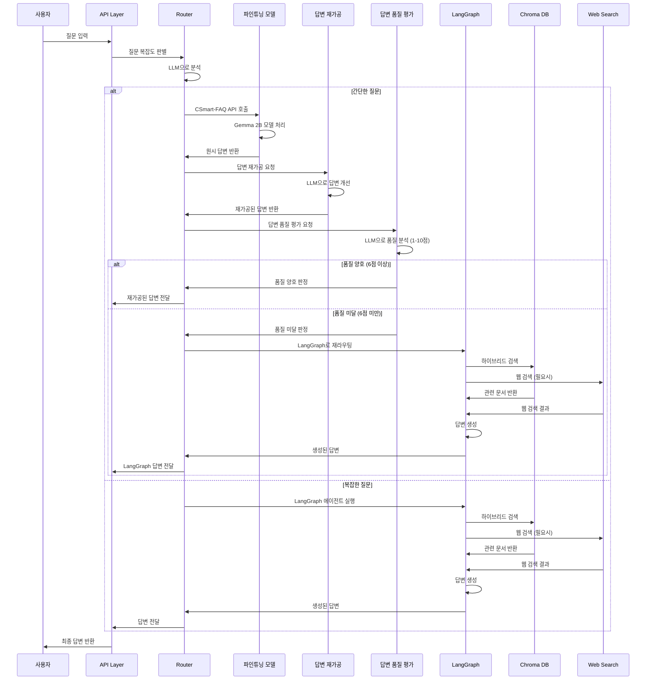
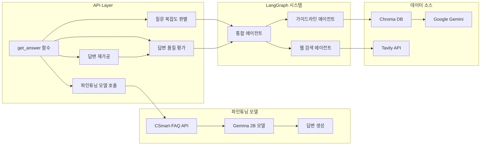
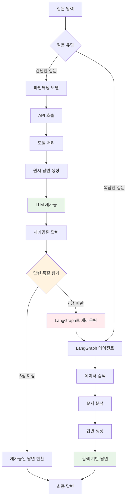

# CSmart 시스템 아키텍처

## 전체 시스템 구조

## 라우팅 로직 상세

## 데이터 흐름도

## 컴포넌트별 상세 구조

## 답변 처리 방식 비교

## 주요 특징

### 1. 자동 라우팅
- 질문 복잡도에 따른 자동 모델 선택
- LLM 기반 지능형 분류

### 2. 이중 시스템
- **간단한 질문**: 파인튜닝 모델 (빠른 응답)
- **복잡한 질문**: LangGraph 에이전트 (상세한 답변)

### 3. 답변 처리 방식
- **파인튜닝 모델**: 원시 답변 생성 → LLM 재가공 → 답변 품질 평가 후 6점 이상이면 그대로 반환, 미달 시 LangGraph로 재라우팅
- **LangGraph**: 검색 기반 답변 생성 및 재가공

### 4. 확장성
- 새로운 데이터 소스 추가 가능
- 에이전트 모듈화 설계

### 5. 오류 처리
- 각 단계별 오류 처리
- 파인튜닝 모델 오류 시 LangGraph로 자동 폴백
- 답변 품질 미달 시 자동 재라우팅
